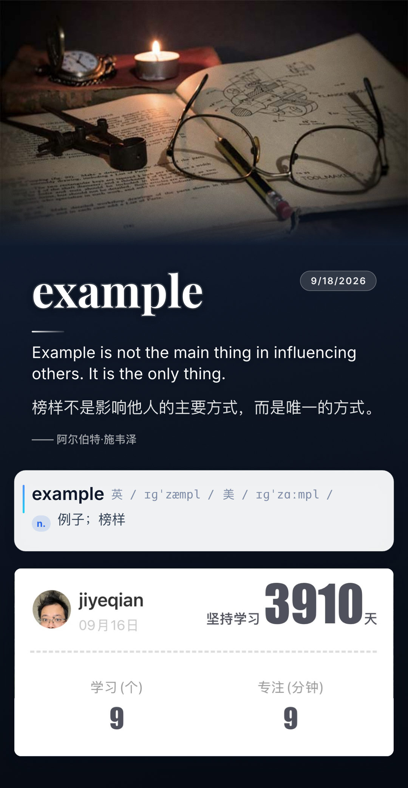

# 每日一句 · 海报生成器

把 [欧路词典「英语每日一句」](https://dict.eudic.net/home/dailysentence) 的当日内容，
和乐词 App 的「个人信息卡片」模板合成为一张可以发朋友圈的竖版手机海报。

一句话概括：**打开网页 → 自动抓取今日金句 → 长按保存**。

| 线上地址（手机可直接打开） | 说明 |
| --- | --- |
| <https://dailysentence.app.workbuddy.host/> | 支持「添加到主屏幕」，当 App 用 |



---

## 怎么用

打开链接，等一两秒，屏幕上就是当天做好的海报。**界面上一个按钮都没有 —— 所有功能都由手势承载**：

| 你想做什么 | 怎么做 |
| --- | --- |
| **保存到相册** | **长按海报任意位置**。iPhone 会弹出一张原图浮层（长按那张图 → 存储到照片）；桌面 / Android 直接下载 `dailysentence-YYYY-MM-DD.png` |
| **换掉顶部配图** | **单击顶部图片**（或右下信息卡）→ 从相册选图 → 进入调整层：单指挪图、双指缩放、点窗口换一张、点窗口外完成 |
| **听这句怎么读** | **单击英文句** → 朗读并在句子上浮起一条细波形；点波形停止 |
| **看昨天那句** | **单击右上角日期胶囊** → 今日 ⇄ 昨日存档切换 |
| **删掉某个元素** | **双击** 日期 / 英文句 / 中文句 / 出处（不可逆，刷新即恢复） |
| **字号不合适** | 在文字上**上滑放大、下滑缩小**（英文 / 中文 / 出处联动，日期单独；日期最多放大 3 倍、句子 1.6 倍） |
| **回到初始状态** | 从非句子处**向下拉 ≥ 90px**，等同重启：换的图、删的元素、改的字号全部复原 |
| **换一套配色** | **摇一摇手机**，在墨蓝夜空 → 暖纸墨字 → 绛红夜 → 青瓷浅冷之间循环。iOS 首次点海报会请求「动作与健身」权限，允许后才能摇 |
| **换版式** | **双指张开** = 标准版 → 长版；**双指捏合** = 长版 → 标准版；**把手机横过来放**自动进横屏版，竖回去自动切回 |

几条约定：

- **刷新即初始**：换的图、删的元素、缩放都不记忆；只有「版式 / 配色 / 主题」按设备记住。
- 首次进入会显示一行操作提示，3 秒后自动消失。
- 顶部配图按**宽度铺满 + 超出裁切**，永远不会盖住下面的句子。
- 配色**随图匹配**：第一次打开或换了配图后，会自动挑一套与图片色调最合的；摇一摇可随时手动改，下次换图再自动匹配。

## 三种版式

| 版式 | 怎么进 | 长什么样 |
| --- | --- | --- |
| **标准版**（默认） | 打开即用 | 顶部配图 + 日期胶囊 + 英 / 中 / 出处 + 个人信息卡；画布恒 1080×1920 |
| **长版** | 双指张开（或 `?long=1`） | 标准版的内容 + 关键词大标题 + 单词卡（音标 / 词性 / 释义），按内容长高 |
| **横屏版** | 把手机横过来放 | 配图铺满整幅海报、文字直接压在照片上（按照片明暗自动选深浅字色与阴影），右栏文字 + 右下信息卡 |

## 本地打开

```bash
cd app
node server.js            # 默认 http://localhost:8787
PORT=3000 node server.js  # 自定义端口
```

要求 **Node.js ≥ 18** —— 只用内置模块，无需 `npm install`。

## 说明

内容版权归欧路词典 / 每日英语听力所有。本项目仅将公开页面内容排版为个人打卡海报，
请勿用于商业用途。字体 Inter、Playfair Display、EB Garamond 均为 SIL Open Font License 授权，已自托管。

想改这个项目、或想弄清它是怎么实现的，看这几份文档：

| 文档 | 内容 |
| --- | --- |
| [`docs/开发指南.md`](docs/开发指南.md) | 目录结构、接口、调试参数、验证链、部署、抓取与合成的实现要点 |
| [`docs/界面设计演进简史.md`](docs/界面设计演进简史.md) | 界面与交互是**怎么一步步演进**到今天的（时间线 + 每步的理由与利弊） |
| [`docs/标注通道-使用手册.md`](docs/标注通道-使用手册.md) | **改界面前先读**：编号标注图 + 区域命名表 + 报问题的句式 |
| [`app/README.md`](app/README.md) | 抓取、解析、兜底与合成分层的实现细节 |
| [`CODEBUDDY.md`](CODEBUDDY.md) | 项目约定与改动铁律（上游兼容、抓取节流、交互原则等） |
