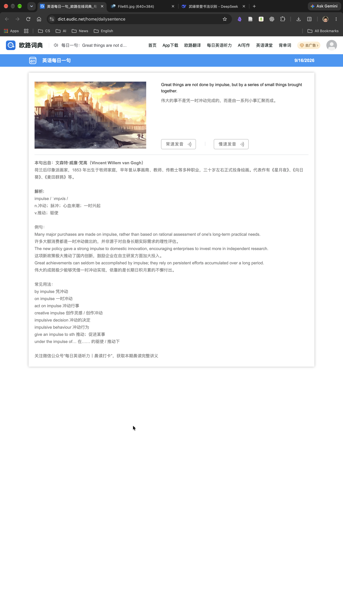

# 开发指南

> 面向要改这个仓库的人。三份配套文档分工如下：
>
> | 文档 | 管什么 |
> | --- | --- |
> | 本文件 | 怎么跑、接口、调试参数、抓取与合成的实现要点、验证链、部署 |
> | [`../CODEBUDDY.md`](../CODEBUDDY.md) | **改动铁律**：上游兼容、抓取节流、界面原则、手势语义（动手前必读） |
> | [`../app/README.md`](../app/README.md) | 抓取 / 解析 / 兜底与合成分层的更细实现说明 |
> | [`标注通道-使用手册.md`](标注通道-使用手册.md) | 改界面用的标注通道（编号图 + 坐标清单 + diff） |
> | [`界面设计演进简史.md`](界面设计演进简史.md) | 界面与交互的演进时间线（含每步的理由与利弊，避免重复踩坑） |

---

## 跑起来

```bash
cd app
node server.js            # 默认 http://localhost:8787
PORT=3000 node server.js  # 自定义端口
```

要求 **Node.js ≥ 18** —— 只用内置模块，无需 `npm install`、无构建步骤。

打开页面后会依次调用 `/api/daily` 取内容、`/api/img` 代理下载配图，然后在浏览器端用 Canvas 合成。

## 验证链（改完必跑）

```bash
node app/parse-check.js        # 解析 + 存档回归（零依赖断言，50 项）
node app/measure.js            # 版面体检：默认不出图，--checks 给逐条 PASS/FAIL，--crop <编号> 出局部放大图
node app/inspect.js            # 版面标注通道：编号图 + 坐标清单（--tag / --diff，详见标注手册）

# 交互回归（需要服务在 8787 跑着）
NODE_PATH=~/.workbuddy/binaries/node/workspace/node_modules node app/ui-check.js
```

`ui-check.js` 用 playwright 驱动真浏览器（含触摸指针、像素探针），跑完在 `app/shots/` 留截图。
注意它的进程退出码在**控制台有 404 时**也是 1（favicon、缺当日存档属已知噪音），判据看最后一行的
「全部断言通过 / FAIL: n 项」。

真机问题走 `?diag=1` 诊断页：页面顶部叠一段纯文本关键数字（形态 / 屏幕与安全区 / 舞台补正 /
海报尺寸与圆角 / 版面与字号 / 照片基调 / 语音自证），**长按面板 → 全选 → 拷贝**贴回来即可报问题。

## 目录结构

```
.
├── README.md                      # 使用说明（怎么用）
├── CODEBUDDY.md                   # 项目约定与改动铁律
├── deploy.sh                      # 按 commit 取版本生成最小部署载荷
├── app/                           # 应用源码（零依赖 Node）
│   ├── server.js                  #   抓取 + 解析 + 图片代理 + 静态托管
│   ├── parse-check.js             #   解析 / 存档回归
│   ├── ui-check.js                #   交互回归（playwright）
│   ├── measure.js                 #   版面体检
│   ├── inspect.js                 #   版面标注通道（编号图 + 清单 + diff）
│   ├── fixtures/                  #   上游页面快照（解析回归的唯一依据）
│   ├── data/                      #   每日存档（gitignore）
│   ├── shots/                     #   截图与标注产物（gitignore，GitHub 上不显示）
│   ├── README.md                  #   实现细节
│   └── public/
│       ├── index.html
│       ├── styles.css
│       ├── app.js                 #   Canvas 排版与合成（单文件模块）
│       ├── manifest.webmanifest   #   PWA
│       ├── icons/                 #   PWA 图标
│       ├── fonts/                 #   Inter + Playfair Display + EB Garamond（OFL）
│       └── assets/template.jpg    # 默认模板
└── docs/
    ├── 开发指南.md                 # 本文件
    ├── 界面设计演进简史.md          # 界面演进时间线
    ├── 标注通道-使用手册.md         # 改界面前先读
    └── images/                    # 文档配图（唯一图片目录）
```

> `app/shots/`、`app/data/` 在 `.gitignore` 里；**要入库的图必须复制到 `docs/images/`**，
> 否则 GitHub 上不显示（演进简史与标注手册的配图就是这么来的）。

## HTTP 接口

| 路径 | 说明 |
| --- | --- |
| `GET /api/daily` | 结构化今日内容（JSON），`?refresh=1` 跳过缓存；上游缺解析时附带 `missing` / `candidates` / `fallback` |
| `GET /api/lookup?word=<word>` | 查词典，补全音标 / 释义 / 双语例句（供「关键词补全」切换候选时调用） |
| `GET /api/img?u=<url>` | 图片代理，仅放行 `static.esdict.cn` 等白名单域名 |
| `GET /api/health` | 健康检查 |

## 调试参数

- `?raw=1` —— 只显示海报本身，便于导出 / 截图
- `?theme=night|paper|ember|celadon` —— 预览指定配色（**只当次生效、不写记忆**；桌面没有加速度计，这是预览四主题的方式）
- `?bg=natural|cover` —— 指定背景模式
- `?long=1` —— 长版海报（旧参数 `?ex=1` 同样生效；**强制指定**，优先于版式记忆）
- `?wide=1` —— **强制并锁定横屏版**（调试开关，2026-09-29）。桌面 / 容器里 `bindOrientation()`
  不生效（它只在移动设备上挂方向感应），这是那些环境里**唯一**能稳定看到横屏版的入口；
  锁定 = 本页不再响应方向变化，横竖都是横屏版。**不写版式记忆**，刷新 / 去掉参数即回原版式；
  优先级高于 `?long=1`（`?wide=1&long=1` 取横屏版，竖回时回到长版）。与 `?raw=1` 组合可导出
  1920×1080 的横屏成品
- `?cardAlpha=0.6` —— 覆盖**横屏信息卡的不透明度**（调试开关）：取值 0–1，缺省 0.82，
  超范围钳到边界，非法值回落 0.82；**仅横屏生效**（标准版 / 长版卡片恒为不透明）。
  传 `1` 就是改造前的不透明白卡，便于同屏 A/B 对照观感
- `?word=&en=&cn=&source=` —— 覆盖文案，便于排版测试
- `?ph=ˈɪmpʌls`（单音标）或 `?ph=英:ɪɡˈzæmpl|美:ɪɡˈzɑːmpl`（双音标）—— 覆盖音标，便于测试排版
- `?fit=device` —— 画布自适应（默认关，框架保留备用）
- `?diag=1` —— 真机诊断页（见上文），这个模式下长按让给系统菜单、不会保存海报
- `?debug=1` —— 挂 `window.__ds`（命中表 / 坐标换算 / `inspect()` / 语音层驱动等），回归与排障用

---

## 抓取与解析要点

**抓到的内容**：中英文句子、关键词、音标（英式 / 美式双音标）、词性释义、例句、出处、网页卡片左上角的配图（每天轮换）、真人发音地址（正常 / 慢速）。



数据源就是这一页（欧路词典「英语每日一句」）；配图取卡片左上角那张每天轮换的图。

几处必须守住的细节（完整背景见 [`../app/README.md`](../app/README.md) 与 [`../CODEBUDDY.md`](../CODEBUDDY.md)）：

- **音标先归一化再排版**：剥掉数据源自带的外层斜杠 / 方括号，统一印成 `英 /dɪˈsiːv/　美 /dɪˈsiːv/`（单音标不加语言标签），不会出现双份斜杠。
- **去标签区分内联 / 块级**：`<span>` / `<a>` / `<b>` 这类内联标签直接删掉、**不补空格**；只有 `</p>` / `<br>` 这类换行标签才换成一个空格 —— 否则会在中文里印出「我对他所说的感到 失望 。」这种多余空白。
- **词条页请求串行、间隔 ≥ 300ms**：上游把释义里的汉字随机换成 ``，并发请求常拿到同一批替换、合并无增量；且高频会被限流 / 302 到登录页。
- **缺字两种成因**：按字固定替换的（重试救不回，整条剔除）与按请求随机抽的（多次请求逐位合并可还原）。
- **分区结束位置取最早标记**：只认 `#ExpSYN` 会漏掉 `#ExpFCchild` 之后的边界，把生词本 / 历史记录的 `<li>` 扫进来当假释义。

### 上游偶尔整段漏发解析时（2026-09-19 起）

欧路偶尔会在「解析」区块整段漏发（只剩一段 CSS），此时页面没有关键词、没有释义、没有例句。
以前的做法是把句子里最长的词当关键词，猜出 `ourselves` 这种结果再挂一张空卡片 —— 比不显示更误导。
现在：

- **不猜词**：从英文句子按「闭类词黑名单 + 词频 + 词长」打分，给出 Top 3 候选，默认选第一个
- **查词典补全**：拿候选词去 `dict.eudic.net/dicts/en/<word>` 取音标 / 释义 / 双语例句；查到「过去式 / 复数」这类词条时自动回查原形（`deceived` → `deceive`）
- **卡片圆标**：关键词 / 释义不是上游今天给的内容时，单词卡片右下角有一个很轻的加圈单字 —— `补`（释义来自词典补全）或 `选`（只是自动选词，没查到释义）
- **改词自动重查**：改关键词后稍停会自动重查并换掉音标 / 释义 / 例句；自己手写过释义则不覆盖
- **该藏就藏**：连候选都没有时**不画单词卡片**，版面自动收紧
- **可人工切换**：页面上可点其它候选重新查词回填
- 上游正常出数据的日子，以上逻辑完全不触发，也不会多发一个请求

## 合成要点（标准版）

| 输入模板 | 目标版式 |
| :---: | :---: |
|  |  |

`input.jpg` = 乐词打卡图模板（提供头像 / 昵称 / 坚持天数 / 学习统计卡片），
`output.png` = 目标版式（文字位置参照）—— 版面尺寸与字号都是对着这两张调出来的。

- 版面**三段式**：顶部图片区（固定 648px 高）→ 中部句子区（日期胶囊靠右，英文 + 中文 + 出处作为一个整体居中）→ 个人信息卡（距左 / 右 / 底三边等距 48px）
- 画布**恒 1080×1920（9:16）**，手机与桌面同一条路径：宽度充满、竖直居中，上下留底色块 —— 屏幕上看到的就是长按另存的那张图
- 文字字号是**固定设计基准**（日期 28、英文 50、中文 44、出处 36），进入就按它显示、不自动放大铺满；只有整块装不下中部区域时才整块等比缩小保底
- **四套配色主题**（2026-09-24 定稿）：墨蓝夜空（默认，冷暗）/ 暖纸墨字（暖浅）/ 绛红夜（暖暗）/ 青瓷浅冷（冷浅）；配色收敛为 `THEMES` 调色板单一来源，画布与标注表都从 `PAL()` 取色
- **主题随图匹配**（2026-09-25）：按图片色调（亮度 / 冷暖）从四套里挑一套，规则与阈值见 [`/CODEBUDDY.md`](../CODEBUDDY.md) 与标注手册的备查表
- **海报四角是圆角（32 设计值）且画进成品**：长按另存的 PNG 本身就是一张圆角卡片（四角透明），屏幕上用同一半径显示
- 竖直「居中」对**整块物理屏**居中：独立应用形态下按「物理屏高 − 布局框高」补一个上内边距，与 iPhone 自己显示同一张 1080×1920 的位置一致；浏览器里不做这个补正
- 顶部图片**按宽度铺满、超出 648px 裁掉**：竖图只显示最上面一段，宽图下方露底色，图片永不盖住中部句子
- 卡片位置**自动识别**：近纯白二值化 + 连通域，取不接触画布边缘的最大白块；标准版只借它决定「从用户图里抠哪一块」，卡片自身位置与尺寸固定
- 中文逐字断行、英文按词断行，并避免行首出现 `，。、；：？！）】》」』` 等标点
- 浏览器 Canvas 合成，**模板图不上传**；英文句用 EB Garamond（自托管），正文 Inter + 苹方混排

**长版**（`?long=1` 或双指张开）：顶部图片块（648 裁切窗口，与标准版同款：点击换图 + 调整层）、
关键词大标题（Playfair Display 衬线）、标题分隔线、毛玻璃单词卡片（左侧渐变竖条、等宽音标、
词性彩色胶囊 n./v./adj.），按内容长高；交互与配色与标准版全量一致（朗读 / 日期切换 / 双击删除 /
字号缩放 / 换图 / 下拉更新 / 主题 / 摇一摇）；例句引用块已整体移除；版式按设备记住。

**横屏版**（把手机横过来放）:配图 cover 铺满整幅海报，文字直接压在照片上（右栏无底板），
按右栏照片亮度分位自动选深墨字 / 亮字并自适应阴影；日期胶囊按竖版物理大小等比映射；
信息卡按标准版 984:496 等比映射，并**整块半透明**（`WIDE_CARD_ALPHA = 0.82`，背景透过卡面可见；
透明度只落在模板图那一层 —— 卡面若再垫一层半透明白底会叠成 ~0.97 几乎不透）。
进出一律由设备方向承载（双指切版只在标准版 ↔ 长版之间）。

---

## 部署

`deploy.sh` 按 commit 取版本生成最小部署载荷（不再读工作区），任意能跑 Node 的平台均可，
只需一条启动命令：

```bash
node server.js          # 监听 process.env.PORT
```

无构建步骤、无 `node_modules`、无外部服务依赖。
