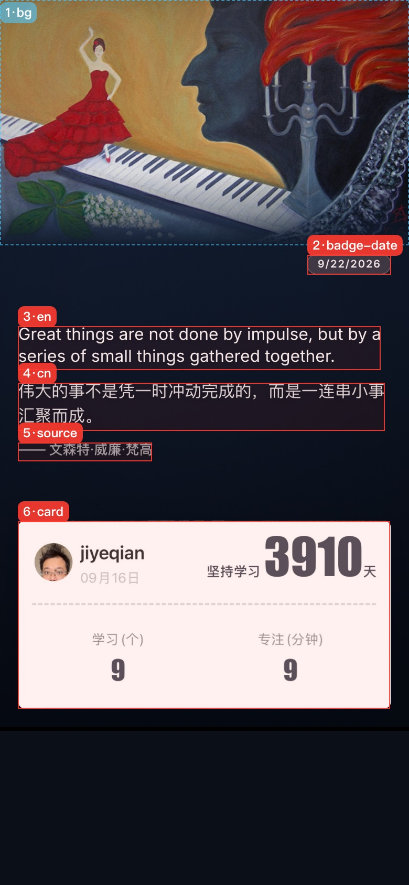
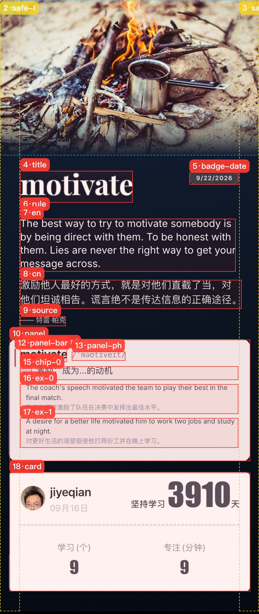
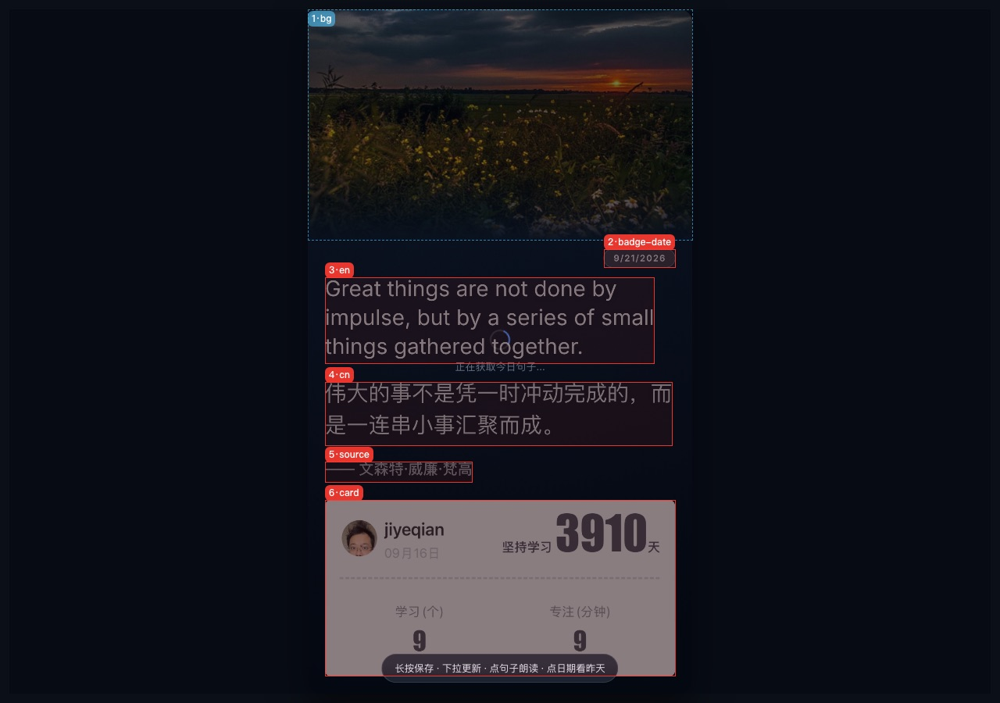

# 版面标注通道 · 使用手册

这份手册只解决一件事：**你改界面时，怎么准确告诉我改哪里。**

不用截图再手绘标注，也不用我识别图像猜位置。流程就一句：

> **跑一条命令出一张带编号的图 → 你报编号 → 我改代码 → 我出 diff 自证 → 你看图验收。**

编号是双方共用的坐标。你看到的是「4 号」，我读到的是 `cn` 的 `box [48, 1045, 976, 179]`、字号 `61.3`。

> 命名表、id 拼写以 [`app/README.md`](../app/README.md) 的「版面标注通道」一节为唯一权威；本手册内嵌一份同步副本，若两处不一致，以那边为准。

---

## 1. 就位检查

本机实测可用（2026-09-21）：

| 项 | 现状 |
| --- | --- |
| Playwright | `1.63.0`（`playwright` + `playwright-core`） |
| 位置 | `~/.workbuddy/binaries/node/workspace/node_modules` |
| 浏览器 | `~/Library/Caches/ms-playwright`（chromium-1234 / chromium-1243 / headless shell / ffmpeg） |
| Node | v26.9.0（项目要求 ≥ 18） |

⚠️ **注意**：Playwright **不在 `package.json`** 里，是靠 `NODE_PATH` 借用 WorkBuddy 的那一份。所以换机器、或 WorkBuddy 大升级之后可能借不到 —— 那时按提示自己装一份即可：

```bash
npm i -D playwright && npx playwright install chromium
```

自检三条（在项目根目录）：

```bash
# 1) 起服务（另开一个终端，或加 & 放后台）
node app/server.js

# 2) 服务活着
curl -s http://127.0.0.1:8787/api/health      # → {"ok":true,...}

# 3) 标注通道能跑（--no-shot 只出数字，最快）
NODE_PATH=~/.workbuddy/binaries/node/workspace/node_modules \
  node app/inspect.js --tag test --no-shot | head -5
```

第三条打出版面清单，就说明整条链路通。

停服务：

```bash
lsof -ti :8787 | xargs kill
```

---

## 2. 三步上手

### 第 1 步 · 起服务

```bash
node app/server.js            # 默认 http://localhost:8787
```

### 第 2 步 · 出标注图

```bash
NODE_PATH=~/.workbuddy/binaries/node/workspace/node_modules \
  node app/inspect.js --tag v1 --raw --full
```

跑完在 `app/shots/` 得到：

- `annot-v1.png` —— **编号标注图，给你看的**
- `inspect-v1.json` —— **坐标清单，给我读的**

终端还会打印一张「编号 → id → 中文名 → 坐标 → 字号」对照表，可以直接复制给我。

### 第 3 步 · 看图报编号

打开 `app/shots/annot-v1.png`，用图上的编号或 id 告诉我改哪里（下一节有句式）。

---

## 3. 产物说明

### 标注图怎么看

| 线型 | 含义 |
| --- | --- |
| 🔴 红实线 + 浅红底 | 内容元素（图片区、日期胶囊、句子、信息卡……） |
| 🟡 黄虚线 | 文字安全边距（`safe-l` / `safe-r`，仅长版，左右各 84px） |
| 🔵 蓝虚线 | 背景图区（`bg`） |
| 🟣 粉线 | 右下来源圆标（`badge-src`，仅长版，且只在「补 / 选」兜底内容出现时才有） |

每个框左上角有 `编号·id` 标签（例如 `2·badge-date`）。

> **编号规则**：按版面**从上到下**排（先比 y 再比 x）。所以「几号」=「从上往下第几个」，不用来回找。

### 示例图

**① 标准版（手机视口）** —— 手册主图。标准版只有 6 个可标注元素，自上而下编号 1–6：
`bg / badge-date / en / cn / source / card`。顶部图片**按宽度铺满、超出 648px 的部分裁掉**；
`en / cn / source` 作为一个整体在中部区域里**垂直居中**，字号按**固定设计基准**显示
（不再自动放大铺满，只有整块装不下时才等比缩小保底）：



**② 长版海报**（`--long`）—— 长版仍保留关键词大标题、分隔线与整张单词卡，
`title / rule / panel* / def-* / chip-* / ex-* / badge-src` 都在，编号从 1 另外排一遍：



**③ 桌面视口**（`--desktop`）—— 同一份标准版版面，**编号与坐标完全不变**，只有截图尺寸不同：



> 三张图都由 `app/inspect.js --full`（整页截图）生成，固定文案见本手册最后一节，可原样重跑复现
> —— 编号与坐标完全一致（海报底噪是随机的，像素不会逐点相同）。
> 入库时转成了 JPEG 以控制仓库体积（PNG 压不动那份噪点）。

> ⚠️ **双击隐藏了元素之后编号会重排**（编号是按版面从上到下现算的）。
> 想拿两份快照做 `--diff` 对比时，先刷新页面回到 6 个元素的状态再跑。

### 清单 JSON 有什么

```json
{
  "canvas": { "w": 1080, "h": 1920, "u": 1,
              "physW": 1080, "physH": 1920, "bitmapW": 1080, "bitmapH": 1920,
              "adaptive": false, "safe": { "top": 0, "bottom": 0 } },
  "items": [
    { "i": 4, "id": "cn", "label": "中文句",
      "box": [48, 1011, 968, 129.4], "font": 44,
      "color": "rgba(255,255,255,0.88)", "text": "伟大的事不是凭一时冲动完成的…", "kind": "item" }
  ],
  "gaps": [
    { "id": "band-h", "label": "中部活动区高度", "px": 576 },
    { "id": "gap-img-text", "label": "活动区顶 → 文字块顶", "px": 39 }
  ],
  "text": { "fx": { "badge-date": 1, "en": 1, "cn": 1, "source": 1 }, "base": 1, "x": 48,
            "band": { "top": 752, "h": 576 } },
  "bg": { "w": 1080, "h": 1922, "blockH": 648, "clipped": true, "blankBottom": 0 },
  "stage": { "standalone": false, "padTop": 0, "screenH": 844, "frameH": 844 },
  "voice": null,
  "voiceDiag": { "lastReason": "ended", "lastAt": 1790070263339, "playedMs": 4210, "dur": 4.3,
                 "url": "…/speakweb?txt=…", "playedFrom": 1790070259129,
                 "errName": "", "retries": 0 },
  "edit": null,
  "fits": { "img": { "scale": 1, "ox": 0, "oy": 0 },
            "card": { "scale": 1, "ox": 0, "oy": 0 } },
  "opts": { "bgStyle": "cover", "longPoster": false },
  "theme": { "id": "night", "name": "墨蓝夜空" },
  "ratios": { "L": 0.0364, "T": 0.5934, "R": 0.9636, "B": 0.8491 },
  "meta": { "date": "9/21/2026", "word": "impulse", "autoKind": "", "bgImage": true,
            "hidden": { "date": false, "en": false, "cn": false, "source": false } }
}
```

`box` 是 `[x, y, w, h]`，**设计坐标**（宽恒 1080 基准），和点击命中表同一坐标系 —— 所以「图上看到的位置」和「代码里的数值」是一一对应的。

> **坐标永远以 1080 为基准、跨设备不用换算**：默认画布固定 1080×1920（`adaptive: false`、
> `u: 1`），手机与桌面拿到的是同一份版面；只有加 `?fit=device` 时才按设备分辨率出图
> （`adaptive: true`、`u = 位图宽 / 1080`，例如 1180×1978）。`canvas.bitmapW/bitmapH` 是画布缓冲
> 实际尺寸（长版按内容长高，会比 `physH` 更高）。报编号 / 报坐标时都不用关心设备。

`text` 是文字区的字号状态（2026-09-22 改口径：不再自适应放大），自证「字体改了多少」直接看它：

| 字段 | 含义 |
| --- | --- |
| `text.fx` | **2/3/4/5 各区自己的交互倍率**（1 = 设计基准字号；`badge-date` / `en` / `cn` / `source`）。上滑放大、下滑缩小：下限 0.6，**上限 2 区 3 倍、3/4/5 区 1.6 倍**；3/4/5 联动、2 区独立 |
| `text.base` | **保底倍率**：只有整块装不下活动区时才 < 1（整块等比缩小，保证不压到信息卡）；短内容恒为 1 |
| `text.x` | 正文左基线（标准版 48；长版 84） |
| `text.band` | 中部活动区 `{ top, h }`（2 区放大时胶囊变高，活动区整体下移并变矮） |
| `theme` | **当前配色**（2026-09-24 加）：`{ id, name }`，id ∈ `night / paper / pine / dusk`。摇一摇切换、按设备记忆；`?theme=<id>` 可当次预览。标注表里的 `color` 列**随主题走**（浅色 `paper` 下文字是深墨色）—— 对颜色的反馈请连同主题一起说 |

> **实际字号 = 设计基准 × `text.base` × 该区 `text.fx`**。设计基准（标准版）：
> 3 区 50、4 区 44、5 区 36、2 区（日期胶囊）28 —— 这是「进入应用即显示」的固定值，
> 不再随句子长短自动放大或缩小。

`bg` 是顶部图片的**实际绘制结果**（`clipped: true` = 图片被裁掉了溢出部分，
`blankBottom` = 图片下方露出的底色高度）—— 「图片有没有糊到中部」看它就知道，不用看图。

`edit` / `fits` 是换图后的**手动调整**状态：`edit` 非空表示正处在调整模式（`target` = 在调哪一块；
`window` = 那张换图弹层里窗口的 rect（层内 CSS px，就是 client 坐标）；`radius` = 它的圆角
（CSS px；1 区与 6 区都是圆角），`fits` 是两块图各自的缩放与位移
（`scale = 1, ox = oy = 0` = 刚换上的默认样子）。

> **调整模式长什么样**：换完图会弹出**独立的不透明整屏层**，**原海报完全不动、也不出现在层里**；
> 层里只有居中的换图区与这张图 —— 窗口内清晰，窗口外是同一张图压暗约 62% 的其余部分
> （拖动 / 缩放的引导）。窗口尺寸 = 该区成品尺寸（1 区约 402×241pt、6 区约 366×185pt，不放大），
> 形状是圆角矩形。**没有任何描边 / 虚线** —— 亮暗交界就是区域边界（历史上的青色虚线框已删除）。
> 层里看不到海报，所以**点不了另一块**：点窗口 = 换同一张，点窗口外 = 完成；
> 要换另一块就先完成、再点海报上那一块。

`stage` 是**海报在屏幕上的竖直摆位**（见下）：`standalone` = 是不是「加到主屏」的独立全屏形态，
`padTop` = 为此补进 `#stage` 的上内边距，`screenH` / `frameH` = 物理屏高与系统给的那块布局框高。

> **海报怎么摆在屏幕上**：宽度充满优先，竖直方向**对物理屏居中**。注意独立全屏（加到主屏）形态下，
> 系统给的布局框比物理屏矮一个状态栏且锚在屏幕顶端，直接在框里居中会让海报整体偏上半个状态栏
> （照片压在刘海下、底部多一截黑）。所以那种形态下会按 `padTop = screenH − frameH` 补一个上内边距，
> 把它拉回整屏居中，与 iPhone 自己显示同一张 1080×1920 的位置一致。
> **浏览器（手机 / 桌面）里 `padTop` 恒为 0** —— 那里的布局视口就是可见区，加了反而会把海报顶出屏幕。
> 真机整屏截图可用像素量测复核，判据是**上留白与下留白之差 ≤ 10 设备像素**。

> **海报四角是圆角（32 设计值）**：圆角**画在 canvas 里**（所以长按另存的 PNG 本身就是一张圆角卡片、
> 四角透明），屏幕侧用**同一半径**显示（= 32 × 显示比例，由 `syncPosterRadius()` 写进 `#poster`）。
> 因此「屏幕上看到的 = 长按另存的」依然成立。要复核的话：把另存的 PNG 铺在白底上看，
> 四角应是透明的圆角；量画布四角像素 alpha 应为 0、圆角内为 255。
> ⚠ 改这一块时记住口径是「**圆角只许画进 canvas，不许只加 CSS**」。

`voice` 是**语音独占层**的状态：`null` = 没在朗读（所有区域都能操作）；非 `null` 时形状是
`{ active: true, target: "en", style: "bars", since }` —— 此刻**只有那块波形可点**，
它是播放期唯一的停止按钮（点它就停、波形消失、其余区域立刻恢复），其它区域一律不可操作
（不保存、不更新、不缩放、不删除、不弹相册）。它盖在 3 区（英文句）上，**只有竖条、没有底板**，
宽度是正文列宽的 90%、居中基准是**3 区文字框**（所以相对句子左右留白相等），
句子仍读得出来；它是 DOM 浮层，**不进 canvas**，也不进 `?raw=1` 的导出图。

`voiceDiag` 是**朗读自证**（2026-09-22 新增，用来排查「有声音没波形 / 有波形没声音 / 播一半就断 /
第一次点总失败」）：每次点英文句会重置成新的一次尝试，收尾时写入这几项 —— `lastReason` 是
**这次为什么结束**（`ended` 正常播完 / `pause` 被外部暂停 / `stalled` 卡死被看门狗收 /
`error` 加载或解码失败 / `emptied` / `timeout` 硬上限 / `tap` 点了波形 / `restart` 新一轮朗读 /
`reset` 下拉更新 / `play-rejected` 浏览器拒绝播放），`playedMs` 是**实际响了多久**，
`dur` 是音频时长，`url` 是这次用的音频地址；`errName` 是播放失败时的**错误名**
（`NotAllowedError` 被浏览器拒绝 / `AbortError` 播放被打断 / …），`retries` 是这次**自动重试了几次**。
真机再出问题时，`?debug=1` 下读它就够了：

- `lastReason: "pause"` 且 `playedMs` 只有几百毫秒 → **播到一半被系统暂停**（来电 / 切 App /
  音频会话被抢），不是波形逻辑的问题
- `errName: "AbortError"` → 播放被中途打断（正常路径下不该再出现：2026-09-22 起冷启动首点会预热
  发音、且绝不再打断挂起的 `play()`）
- `errName: "NotAllowedError"` → 浏览器没放行自动播放（页面还没拿到用户手势激活），点一下基本就好
- `retries: 1` → 第一次失败后自动重试成功了（说明当时确实卡了一下，值得留意网络）

---

## 4. 命名表（共同词汇）

**标准版只有 6 项**：`bg / badge-date / en / cn / source / card`。其余 id 只在长版（`?long=1`）出现。

| id | 中文名 | 版本 | 备注 |
| --- | --- | --- | --- |
| `bg` | 背景图区 | 都有 | 标准版 = 顶部固定 648px 那块（宽度铺满、超出裁切，换图后可手动调整）；长版 = 整张画布或图片自然高度 |
| `badge-date` | 日期胶囊 | 都有 | 中部区域顶部靠右（右线对齐 48）；**单击 = 切今日/昨日**，双击 = 删掉它；**上下拖动 = 缩放它的字号**（与句子区彼此独立） |
| `en` / `cn` | 英文句 / 中文句 | 都有 | 左线 48；**只有英文句单击 = 朗读**（并升起波形层），中文句单击不发音；两者双击 = 删掉它；上下拖动 = 缩放字号 |
| `source` | 出处 | 都有 | `—— ` 前缀一起算在框里；单击不发音，双击 = 删掉它 |
| `card` | 个人信息卡 | 都有 | 标准版固定在 x=48、984×496（三边等距 48） |
| `title` | 大标题关键词 | 仅长版 | 118px 起，放不下自动缩到最低约 56px |
| `rule` | 标题分隔线 | 仅长版 | |
| `panel` | 单词卡整体 | 仅长版 | 毛玻璃卡片 |
| `panel-bar` | 左侧渐变竖条 | 仅长版 | |
| `panel-word` | 卡内关键词 | 仅长版 | |
| `panel-ph` | 音标 | 仅长版 | 等宽字体，挤了会逐档缩小 |
| `def-0…n` | 释义第 N+1 条 | 仅长版 | 框含行首词性 |
| `chip-0…n` | 词性胶囊 | 仅长版 | n. / v. / adj. |
| `ex-0…n` | 例句块 | 仅长版 | |
| `badge-src` | 右下来源圆标 | 仅长版 | `补` / `选`，仅兜底内容出现 |
| `safe-l` / `safe-r` | 左 / 右安全边距 | 仅长版 | 各 84px |

**间距量尺**（说「太挤 / 太空」时直接引用 id）：

| id | 含义 | 版本 |
| --- | --- | --- |
| `img-h` | 顶部图片区高度 | 标准版（648） |
| `band-top` | 图片区 → 中部活动区顶（日期胶囊那一行的占位） | 标准版（104） |
| `band-h` | 中部活动区高度（文字块在这里居中） | 标准版（576） |
| `gap-img-text` | 活动区顶 → 文字块顶（居中后的上余量） | 标准版 |
| `gap-text-card` | 文字块底 → 活动区底（居中后的下余量；两者相等等于「居中」） | 标准版 |
| `margin-x` | 左右边距：标准版 = 正文与信息卡距左右（都是 48）；长版 = 文字安全边距（84） | 都有 |
| `bottom-pad` | 信息卡 → 海报底 | 都有（标准版 48） |
| `card-h` | 信息卡高度 | 都有 |
| `top-pad` | 海报顶 → 文字块顶 | 长版 |
| `gap-title-en` | 大标题 → 英文句 | 长版 |
| `gap-text-panel` | 文字块 → 单词卡 | 长版 |
| `gap-panel-card` | 单词卡 → 信息卡 | 长版 |

> **中部文字的字号是固定设计基准**（2026-09-22 起；09-24 换 EB Garamond 后 3 区提到 50）：3 区 50、4 区 44、5 区 36、2 区日期 28 ——
> 进入就按这个显示，**不再自动放大铺满**，所以「太空 / 太挤」在这块是正常且每天的观感一致；
> 短句不会被撑大，长句也只在整块装不下时才整块等比缩小（`text.base < 1`）。
> 想调就自己上下滑动（见 `text.fx`）：**2 区最多能放到 3 倍（胶囊整体等比变大，
> 活动区会随之下移）、3/4/5 区最多 1.6 倍**；或者直接报「3 区字号 44 → 40」这类具体数字。

---

## 5. 怎么报修改

### 🔻 最省事的报法（2026-09-22 起，推荐先看这段）

**一句话就够**：`区域编号 + 现象 + 期望`。例：「**3 区波形左右不匀**，左边空得多，**希望两边一样**」。

剩下的事我来做 —— 量测、定位、改、出图自证，你**不需要截图**：

| 你想说的 | 你要做的 | 我会做的 |
| --- | --- | --- |
| 某个地方不对 | 说一句话（带编号更好） | 跑 `app/measure.js` 把几何 / 留白 / 圆角 / 音频状态量出来（**默认不出图**），再改 |
| 想看某一块具体长什么样 | 说「看看 3 区」 | 跑 `measure.js --crop 3`，**只出那一块**的局部放大图（而不是整屏截图） |
| **iOS 上才有的问题**（声音、装到主屏后的位置、字形） | 手机打开 `?diag=1` → 长按面板 → **全选 → 拷贝** → 把文本贴回来 | 按那几个数字定位；必要时我再出图 |

- **为什么这样省**：一张整屏截图读进来要 1–3k token，同样信息用数字表达只要一两百。
- **什么时候才真的需要截图**：① 系统级 UI（相册 / 分享面板 / 键盘）；② 真机字形与渲染差异；
  ③ 装到主屏后你眼睛看到的实际观感 —— 这三类我在电脑上复现不了。
- `?diag=1` 只是多一个参数：平时界面上什么都没有，它显示的是一段**纯文本**（没有任何按钮），
  并且这个模式下**长按不会保存海报**，长按留给系统的「全选 / 拷贝」。

```bash
# 我这边量的命令（你不用记，写在这里备查）
NODE_PATH=~/.workbuddy/binaries/node/workspace/node_modules \
  node app/measure.js --voice --checks        # 体检 + 逐条 PASS/FAIL
  node app/measure.js --zoom badge-date=3     # 先把 2 区放到 3 倍再量
  node app/measure.js --standalone            # 独立全屏形态（量 --stage-pt 补正）
  node app/measure.js --json                  # 机器可读
```

### ✅ 我一次就能改对的句式

- 「**1 号** `bg` 太高了，648 → 560」（顶部图片区高度）
- 「**2** 日期胶囊小一点，28 → 24」
- 「`band-h` 再大点，576 → 620」（中部活动区高度）
- 「`margin-x` 48 → 36」（正文与卡片一起收窄）
- 「**6** `card` 三边别都是 48，底边留 80」
- 「中部整体再大一点」→ 我调默认的设计基准字号 `SZ_EN` / `SZ_CN` / `SZ_SOURCE`（日期是 `SZ_DATE`）
- 不想给数字也行：「**5** 小了」—— 我先读 JSON 确认当前值，给一版再 diff 给你看

### 这些事你自己动手更快（界面上已经没有按钮了，全靠手势）

| 想要的效果 | 你自己怎么操作 |
| --- | --- |
| 删掉英文 / 中文 / 出处 / 日期某一块 | **双击它**；剩下的内容**不会自动放大**，只是重新居中（若原本在被保底缩小，删掉后可能回到设计基准） |
| 某个文字区大一点 / 小一点 | 在那一区上**上下拖动**（上滑放大、下滑缩小，改的是该区的 `text.fx`）；**3/4/5 联动、2 区独立**；**2 区最多 3 倍（胶囊整体变大）、3/4/5 区最多 1.6 倍**；刷新或下拉更新回到设计基准 |
| 听一遍今天的句子 | **单击英文句**（会等 300ms 确认不是双击）；**只有英文句会发音，中文句 / 出处的单击不发音** |
| 停止朗读 | **点那块波形层**（播放期它升在英文句上，是唯一能点的东西；播完会自己收起） |
| 看昨天的存档 / 回到今天 | **单击日期胶囊**，来回切 |
| 换一套配色 | **摇一摇手机**（四套循环：墨蓝夜空 → 暖纸墨字 → 松烟墨绿 → 紫霞暮色）；桌面用 `?theme=<id>` 预览；配色变了标注表的 `color` 列也跟着变，反馈颜色问题时请连同主题一起说 |
| 换顶部图片 / 信息卡 | **单击**那一块，从相册选图（换完会自动进入调整模式） |
| 调整刚换上的图 | 换完图会**弹出整屏调整层**（海报不动、层里只有居中的换图区与这张图）：窗口内清晰、窗口外是同一张图压暗后的其余部分当引导；**单指拖动**挪图、**双指捏合**缩放、**点窗口**换同一张、**点窗口以外**即完成（保存 / 更新 / 朗读 / 删除让路） |
| 回到最初始的样子 | 在**非句子区**（图片 / 卡片 / 空白）**向下拉 90px 以上**，提示「松手即更新」后松手（等同重启 App） |
| 保存海报 | **长按任意位置**（iPhone 上会弹一张原图浮层，长按那张图 → 存储到照片；桌面直接下载 `dailysentence-YYYY-MM-DD.png`） |

### ❌ 容易让我猜错的句式

| 这样说 | 问题 |
| --- | --- |
| 「左边那个白色的框」 | 海报上有图片、正文、白卡三处 |
| 「整体往上一点」 | 上多少？动哪几个元素？中部是自动居中的，往上挪没有意义 |
| 「那行小字」 | `source` 还是 `badge-date`？ |
| 「单词卡调一下」 | 标准版已经没有单词卡了（只有长版有），说编号最准 |

**兜底**：不确定 id 时，报编号就行 —— 编号一定唯一。

---

## 6. 一个完整回合（含真实 diff 输出）

```
你：跑一下标注图
我：annot-latest.png 好了；编号表见下
    （1 bg / 2 badge-date / 3 en / 4 cn / 5 source / 6 card）

你：1 号矮一点；中部默认再大一点；6 号底边留 80
我：（改代码）→ 跑 --tag v2 → 跑 --diff latest v2

      ~ bg    背景图区（铺满）   Δbox=[0, 0, 0, -88]
      ~ en    英文句           Δbox=[0, -12, 0, +40]
      ~ cn    中文句           Δbox=[0, +28, 0, +40]
      ~ card  个人信息卡        Δbox=[0, 0, 0, -32]
      ~ bottom-pad  信息卡 → 海报底  48px → 80px
      （字号变化看 text.fx / text.base，diff 里的 Δbox 高度差就是它）

你：看 annot-v2.png，说「3 号还差点」或「就这样」
```

**`--diff` 是这套流程的关键**：它让我自证「只动了你点名的那几处」，你甚至不用看图就能核对。`Δbox` 的四个数是 `[Δx, Δy, Δw, Δh]`。

真实输出长这样（标准版 vs 长版，实测截取）：

```
diff inspect-guide.json → inspect-long.json
~ badge-date  日期胶囊  Δbox=[-36, +44, 0, 0]
~ en  英文句  Δbox=[+36, +157.5, -45.7, -131.9]  字号 61.3 → 42
~ cn  中文句  Δbox=[+36, +9.8, -94, -56.5]  字号 61.3 → 42
~ source  出处  Δbox=[+36, -60.3, -128.4, -18.7]  字号 42.3 → 29
~ card  个人信息卡  Δbox=[-10, +864, +20, 0]
+ title  新增  大标题关键词
+ rule  新增  标题分隔线
+ panel  新增  单词卡整体
+ panel-ph  新增  音标
+ def-0  新增  释义 1
+ ex-0  新增  例句 1
…
~ margin-x  左右边距  48px → 84px
~ bottom-pad  信息卡 → 海报底  48px → 84px
```

注意 `字号` 那一列：标准版文字区用的是**新的设计基准**（3 区 50、4 区 44、5 区 36、2 区日期 28），
长版仍是旧基准（42 / 29 / 25）—— 「字体改了没有、改了多少」在 diff 里一眼可见。

---

## 7. 参数速查

| 参数 | 用途 |
| --- | --- |
| `--tag <名>` | 给这次快照命名（默认 `latest`），两次对比时用 |
| `--raw` | 只画海报本体，最干净 —— 日常都建议加 |
| `--full` | **整页截图**：海报比视口高时（长版 / 版面加高）也能截全 |
| `--desktop` | 桌面视口 1280×900（默认手机 390×844 @2x） |
| `--long` | 长版海报，能看到例句块 `ex-0…2` |
| `--no-shot` | 只要 JSON / 数字，不出图（最快） |
| `--word/--en/--cn/--source` | 固定文案，**两次对比时必加** |
| `--bg natural\|cover` | 指定背景模式 |
| `--base <url>` | 服务地址（默认 `http://127.0.0.1:8787`） |
| `--diff <改前> <改后>` | 逐项比对坐标 / 字号 / 文案 / 新增移除 / 间距 |

`--diff` 的两个参数可传 `tag`（自动找 `app/shots/inspect-<tag>.json`）或直接给文件路径：

```bash
node app/inspect.js --diff v1 v2
node app/inspect.js --diff app/shots/inspect-v1.json /tmp/other.json
```

> **对比时必须固定文案**，否则「今天的句子」和「明天改完」不是一回事，坐标没有可比性：
> `--word impulse --en "..." --cn "..."`。

---

## 8. Playwright 是什么（30 秒）

它就是**用脚本开一个真浏览器**。我们只用到它两个能力：

1. `page.evaluate()` —— 在页面里跑 JS 取数据（数据源是 `window.__ds.inspect()`，仅 `?debug=1` 时挂上）
2. `page.screenshot()` —— 截图

所以**你不需要学 Playwright API**，会用上面那张参数表就够了。想自己扩展的话，最小骨架：

```js
const { chromium } = require('playwright');

(async () => {
  const browser = await chromium.launch();
  const page = await browser.newPage({
    viewport: { width: 390, height: 844 }, deviceScaleFactor: 2,
  });
  await page.goto('http://127.0.0.1:8787/?debug=1&raw=1');
  await page.waitForFunction(() => window.__ds && window.__ds.inspect);

  const data = await page.evaluate(() => window.__ds.inspect());
  console.log('可标注元素', data.items.length, '个');

  await page.screenshot({ path: 'app/shots/x.png', fullPage: true });
  await browser.close();
})();
```

跑法同上，需要 `NODE_PATH=...` 前缀。

---

## 9. 失灵排查

| 现象 | 原因 | 处理 |
| --- | --- | --- |
| `[inspect] 跳过：没找到 playwright` | 没借到那份 node_modules | 加 `NODE_PATH=...` 前缀，或按第 1 节自己装一份 |
| 连不上页面 / 超时 | 服务没起 | `node app/server.js` |
| 图上只有上半张海报 | 没加 `--full`，海报比视口高 | 加 `--full` |
| 两次 diff 全是「文案改了」 | 没固定文案 | 加 `--word/--en/--cn` |
| 控制台告警「标注与命中表不一致」 | 派生公式与绘制漂移了（我改出的 bug） | 告诉我，我修 `buildAnnots` |
| 图里缺少某个元素 | 该元素本次没出现（如无出处、非长版、未触发兜底圆标） | 属正常，不是故障 |

---

## 10. 复现本手册的三张图

固定文案（两次跑必须完全一致，才能对比）：

```bash
NP=~/.workbuddy/binaries/node/workspace/node_modules
TEXT=(--word "impulse" \
      --en "Great things are not done by impulse, but by a series of small things gathered together." \
      --cn "伟大的事不是凭一时冲动完成的，而是一连串小事汇聚而成。" \
      --source "文森特·威廉·梵高")

NODE_PATH=$NP node app/inspect.js --tag guide   --raw --full          "${TEXT[@]}"
NODE_PATH=$NP node app/inspect.js --tag long    --raw --full --long   "${TEXT[@]}"
NODE_PATH=$NP node app/inspect.js --tag desktop        --full --desktop "${TEXT[@]}"

# 转 JPEG 入库（PNG 有胶片噪点，体积大）
for t in guide long desktop; do
  sips -s format jpeg -s formatOptions 80 app/shots/annot-$t.png --out docs/annot-$t.jpg
done
```

> 本手册用的就是 `impulse` 这一组文案，所以上面的编号表与图能一一对上。
