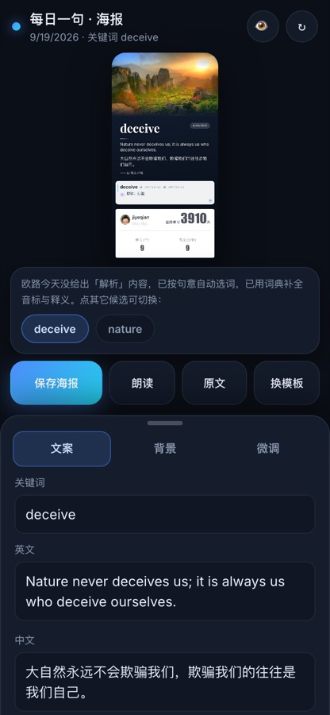
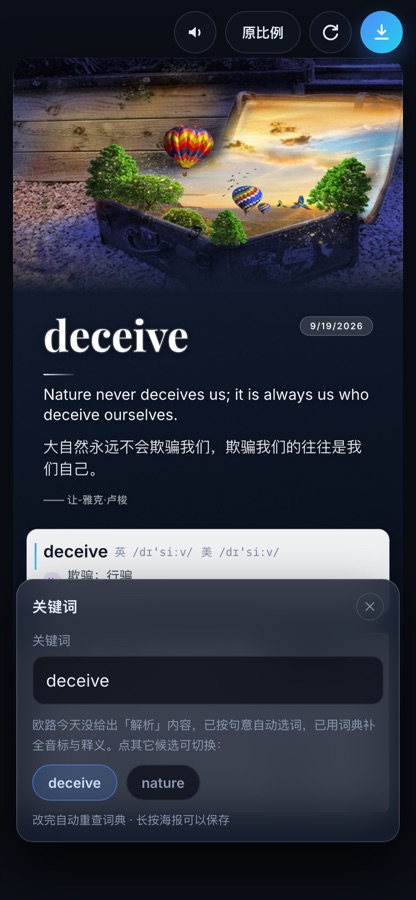
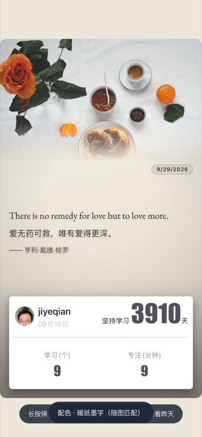
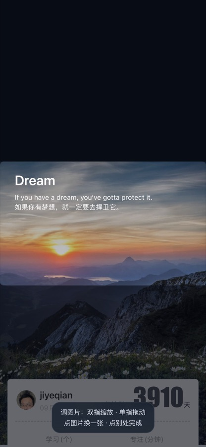
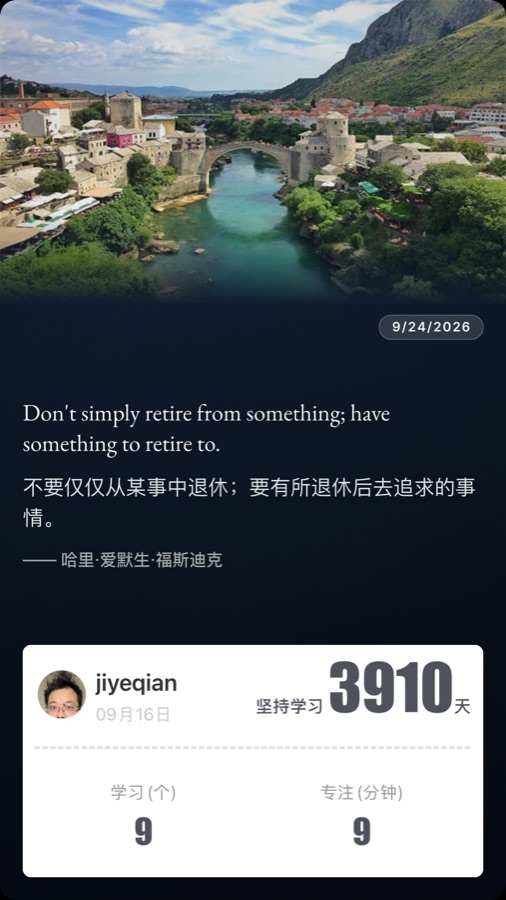
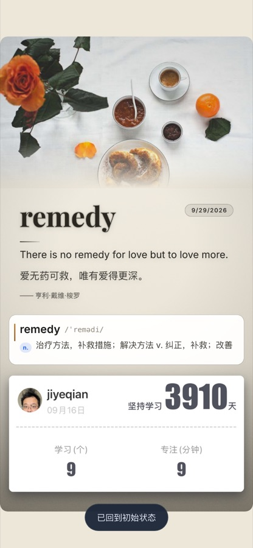
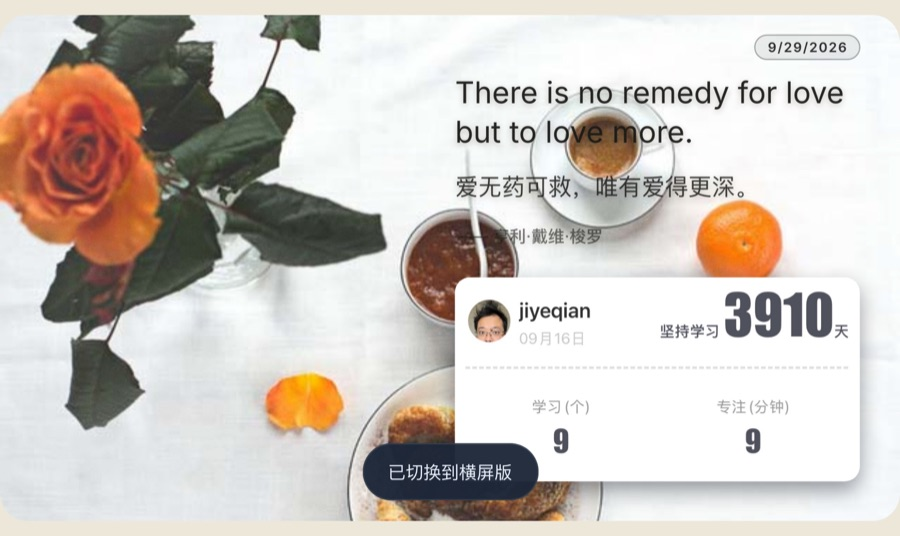

# 界面设计演进简史

这份文档回答一个问题：**这个应用为什么长成现在这样。**
按时间顺序记下每个阶段的界面 / 交互改动，以及当时的**理由**与**代价**（利弊都写，避免后人把
「权衡后的结果」当成「随便定的规矩」再推翻一遍）。

> 配图取自 `app/shots/`（那里的图不入库），已按项目惯例转成 JPEG 收进 [`images/`](images/)。
> 时间以提交日期为准（`git log --date=short`），每一步都能在仓库里找到对应 commit。

## 一句话主线

```
表单 + 按钮                     无按钮手势海报                多版式 + 自适应
（能跑通就行）        ──▶       （显示就是成品）      ──▶     （横屏 / 照片自适应配色）
2026-09-16 ~ 09-19              2026-09-21 ~ 09-25            2026-09-28 ~ 09-29
```

贯穿全程的三条原则（每个阶段都在为它们让路）：

1. **屏幕上看到的就是长按另存的那张图**（画布 = 成品，不做「只影响显示」的装饰）；
2. **界面上一个控件都没有**，功能全部由海报上的手势承载；
3. **配色只有一个来源**（`THEMES` 调色板），任何新观感都从这块调色板生长。

---

## 1. 2026-09-16：先能生成

`5a1a582` 每日一句海报生成器 → `a65d4b8` 重排海报版面并精简控制项。

- **做法**：一个页面，抓欧路「每日一句」+ 用户自己的打卡模板图，在 Canvas 上合成一张竖版海报，右侧/下方带一排控制项（换模板、刷新、导出）。
- **理由**：先把「抓数据 → 解析 → 合成 → 保存」这条链路跑通，界面怎么摆不重要。
- **代价**：控制项越堆越多，海报与表单混在一起；文字位置靠固定比例硬写，改一次版面要动好几处。

## 2. 2026-09-18 ~ 09-19：浮层时代的两步

`cfa1078` 长版只保留例句、移除「常用搭配」→ `9535c33` 浮层式单屏（全屏海报 + 三标签页抽屉）
→ `e6510f4` 点哪改哪（去掉全部菜单）。




> 左图是这个阶段最有代表性的一张：顶栏还有两个图标按钮，海报被挤成中间一小块预览，
> 下面依次是说明卡、**四个大按钮**（保存海报 / 朗读 / 原文 / 换模板）与展开的**表单抽屉**
> （文案 / 背景 / 微调三个标签，输入框直接改关键词、英文、中文）。右图是同阶段的
> 「关键词」候选浮框特写 —— 上游漏发解析时的补词入口。这两张图解释了为什么下一阶段要
> 「无按钮化」：屏幕上真正属于海报的地方，只剩不到三分之一。

- **做法**：全屏海报打底，改内容靠抽屉 / 浮框（点「关键词」弹出候选词浮层）；顶栏仍有朗读 / 原比例 / 刷新 / 保存四个图标按钮。
- **理由**：
  - 删「常用搭配」是因为**上游多出来的字段：解析要兼容、展示要克制** —— 搭配区价值有限却明显拉长画布（这条判断后来被反复引用）；
  - 「点哪改哪」是为了少一层「先找入口」的心智：想改关键词就直接点关键词。
- **代价**：浮框会盖住海报（改完才知道版式变没变）；状态一多，「刚才点了哪、浮框开着没有」都要在回归里逐条盯；顶栏按钮在手机上永远占一条空间。

## 3. 2026-09-21：无按钮化 + 三段式（**关键转折**）

`5c65503` 标准版重构：去掉全部浮层 → 「顶部图片 + 句子 + 信息卡」三段式
→ `b8de7a7` 中部句子自适应缩放 + 上下滑动缩放 → `5a030fb` iOS 长按保存改走浮层原图
→ `c1b77d4` 换图后进入手动调整模式 → `fd54bac` / `1d93f62` 版面标注通道 + 使用手册。



- **做法**：整屏只有海报本体；顶栏、浮框、控件仓库、引导动画全部删除；功能改由手势承载（长按保存 / 单击换图 / 单击朗读 / 双击删除 / 上下滑缩放 / 下拉复位）。同时把「第几区」变成团队共用的说法，配上编号标注图。
- **理由**：
  - **显示 = 成品**：只要屏幕上还有按钮、浮框、角标，就不能保证「截屏 / 另存」与所见一致；去掉之后这条从「尽量」变成「结构上必然」；
  - 报问题只需要说「3 区波形左右不匀」这种句子，于是**标注通道**（编号图 + 坐标清单 + diff）成了改界面的事实入口；
  - 手势省掉了所有「找入口」的成本，符合手机上一根拇指的用法。
- **代价**：
  - 第一次用必须被教一次 —— 留了一行 3 秒后自动消失的提示，仅此一处；
  - 同一元素既有单击又有双击时，必须等 300ms 确认（单槽 `pendingTap`），否则双击会先触发单击；
  - 没有可见控件，功能藏得深，**回归必须守住**：此后每加一个手势都要在 `ui-check.js` 里钉断言。

## 4. 2026-09-22：圆角、波形、调整层、画布口径

`8ae9088` 语音独占波形层 → `2cbb35d` 画布改回固定 1080×1920（自适应降级为 `?fit=device`）
→ `81a56ed` 独立全屏下把海报补齐到整屏居中 → `c4b6d0c` / `d246cdc` 调整层两次改版
→ `6dbac4d` / `d36d793` 字号基准与分区缩放 → `c072045` / `3d37d44` 波形与圆角收口
→ `3f78e5c` 加体检脚本与 `?diag=1` 真机诊断页。



- **做法**：
  - 海报四角改成 32 设计值的**圆角，而且画进 canvas**（长按另存的 PNG 本身就是圆角卡片），屏幕用同一半径显示；
  - 点英文句朗读时，句子上浮起一条**只有竖条、没有底板**的波形层，播放期间成为独占态（只认「点波形停止」）；
  - 换图后进入调整层：铺满整屏的不透明层里只有居中的换图窗口与这张图，**窗口内清晰、窗口外压暗**，没有任何描边虚线；
  - 画布口径定稿：**恒 1080×1920**，手机与桌面同一条路径。
- **理由**：
  - 圆角让成品贴进聊天 / 文档时更像一张卡片；但**屏幕必须同半径**，否则「显示 = 成品」破功；
  - 波形**画进 DOM 浮层而不是 canvas**：画进 canvas 会被长按另存和 `?raw=1` 一起导出去；
  - 调整层改成独立不透明层，是因为上一版「把海报平移让该区居中」会把海报其它内容留在视野里，版面杂乱、且必然有一头移出屏幕；
  - 画布**先试过按设备自适应**（`a5ba408`）：真机上版面差异明显、iOS 启动瞬间视口高度先大后小，版面会跳一次 —— 于是改回固定画布，自适应降级为开关留下备用。
- **代价**：波形、调整层、圆角都各带来一批「只影响显示还是也影响成品」的边界，每次都要在回归里钉住（`?raw=1` 里不许有波形、调整层不进成品位图、圆角必须画在 canvas 里）。

## 5. 2026-09-24：字体与配色体系

`479a496` / `e20d20c` 英文句换 EB Garamond 并定字号 → `9c40152` / `e9c77bf` 四套主题与摇一摇
（`2f6aeb5` iOS 授权改挂 `pointerup`）→ `c735444` / `a8d8a8a` 长版全量迁移 + 双指切版。




- **做法**：
  - 英文句用 EB Garamond（自托管 woff2），字号从「按当天内容自适应放大」改为**固定设计基准**（日期 28 / 英文 50 / 中文 44 / 出处 36），只有整块装不下时才整块等比缩小保底；四个文字区各自支持上下滑缩放（3/4/5 联动、2 区独立）；
  - 配色收敛成 `THEMES` 四套调色板（墨蓝夜空 / 暖纸墨字 / 绛红夜 / 青瓷浅冷），**摇一摇**循环切换，选择按设备记住；
  - 长版（`?long=1`）不再是「只能看的展示版」，交互与配色与标准版全量对齐；双指张开 / 捏合在标准版与长版之间切。
- **理由**：字体决定观感（衬线英文比无衬线更有「句子」的气质）；配色做成**单一来源**，后来加主题只需在 `THEMES` 里加一条；长版若交互缺一半，等于维护两套产品。
- **代价**：可调项变多（字号 / 主题 / 版式 / 授权），都靠**自证字段**兜住 —— `inspect()` 与 `?diag=1` 让真机问题能贴文本回来说清楚，不必靠截图猜。

## 6. 2026-09-25：主题随图匹配

`bb144df` 主题随图自动匹配。

- **做法**：初始化、下拉更新、换配图后，按图片的亮度 / 冷暖从四套里挑一套最合的（亮暖→暖纸、亮冷→青瓷、暗暖→绛红、暗冷→墨蓝）；**不写主题记忆**。
- **理由**：用户不会为了配图去摇手机选颜色，自动挑一套比默认固定一套更讨喜；四套本身的明暗已按「可读性」设计过。
- **代价**：会自动覆盖用户手摇的选择（用户拍板接受）；匹配规则与阈值必须写进备查表，否则「为什么今天变成这个色」没法解释。

## 7. 2026-09-28：横屏版

`1109ac6` 恢复横屏版式 → `e895822` 字号保底 + 双指切版回两态 + 波形贴合右栏 + 冷启动方向校正
→ `7f27409` 背景 cover 铺满整幅 + 信息卡按 984:496 等比 → `b0d5e0c` 命中框修复
→ `9e30524` 日期按竖版物理大小 → `a7b7dfc` 文字配色随照片明暗自适应。



- **做法**：手机横放即进横屏版（位图 1920×1080，设计坐标仍 1080 宽、`U = 16/9`）：配图 cover 铺满整幅、右栏文字 + 右下信息卡；日期胶囊与信息卡按**竖版物理大小**等比映射；进出一律由设备方向承载（双指切版只留在标准版 ↔ 长版之间）。
- **理由**：
  - 横放时 9:16 的海报只能缩成中间一小条，必须有一套自己的版面；
  - **横屏是「设备状态」而不是「内容版式」**：不该写进版式记忆、也不该由手势进出（竖屏里捏进横屏会得到一张塞不进屏幕的版式，真机踩过）。
- **代价**：画布宽高比一变，整套坐标换算都要重新推（设计→屏幕的缩放因子、命中框、波形、调整层窗口），历史坑密集：命中框曾按「对称列」算出负宽、只剩 20 设计值宽，真机表现为「日期能缩放、句子缩放失效」；日期胶囊直接沿用竖版字号则显大 1.78 倍。**结论：横屏任何几何都要从版面自报的字段取，不许沿用竖屏的假设。**

## 8. 2026-09-29：从「垫底板」到「自适应」

`e575407` 授权弹窗窗口内不唤相册 → `f19e76a` 右栏去底板 + 配色按最不利分位 + 阴影自适应
→ 信息卡整块半透明（同日）。

- **做法**：
  - 横屏右栏**去掉半透明底板**，文字直接压在照片上（历史：曾垫一层「深 / 浅幕布」）；
  - 配色判定从「右栏平均亮度 ≥ 150 就选深墨字」升级为**按最不利处对比度择优**：深墨字怕图片最暗处（比 p10）、亮字怕最亮处（比 p90），用 WCAG 口径算两边的「最坏情况对比度」，取更高的一档；
  - 可读性交给**自适应阴影**：暗底亮字「紧而实」、亮底深字「柔而淡」，照片纹理越花越收紧；
  - **右下信息卡整块半透明**（α = 0.56 —— 当日先在 0.82 落地，按实机观感再调透，背景透过卡面可见）—— 透明度只落在模板图那一层；白底改成只负责投影（外圈矩形 + 卡片矩形 `evenodd` 挖空后 `clip`，填充只落在卡外，于是只剩阴影）；
  - 顺带修掉一个交互 bug：运动授权弹窗与「点 1/6 区开相册」挤在同一次手势里会被 iOS 吞掉 —— 现在弹窗窗口内那一按不开相册、改为提示「再点一次」。
- **理由**：
  - 底板会让照片「隔一层」，与「照片铺满」的初衷相冲；底板去掉后，可读性只剩「选对字色 + 足够阴影」两件事，而这两件都能**算**；
  - 均值阈值在灰蒙蒙 / 明暗混杂的图上会选反（白字压在纯白块上直接消失），分位对比度能稳定判住；
  - 卡片若还是实心白块，就成了整幅照片里唯一的「硬补丁」；半透明后它与右栏文字一样「浮在照片上」，观感统一。
- **代价**：照片最干净、更优雅，但可读性的上限取决于阴影强度，极花哨的图上仍可能吃力 —— 为此把阈值（`WIDE_TONE_LUM`）、阴影基值与收紧系数都做成单点可调常量，`inspect().wideTone` 会报出每个决策的依据（分位 / 对比度 / 阴影参数）。卡片半透明另有一个已知取舍：卡内数字与白底是**同一张模板图的像素**，只能一起变淡（做不到「底透、字清」），用户已确认接受。
- **踩坑记录**：第一版实现是「白底 α=0.82 + 模板图 α=0.82」两层叠加 —— 合成透明度变成 `0.82+0.82×0.18 ≈ 0.97`，卡内像素实测 247/255，肉眼几乎看不出透，**被回归里的像素探针当场抓到**（断言「纯黑底上卡内白区 ≤ 245」）。教训：给「自带不透明底的内容」做透明，透明度只能有一层。

---

## 后面的故事怎么接

- **怎么用** → [`../README.md`](../README.md)
- **怎么改（跑起来 / 接口 / 调试参数 / 验证链）** → [`开发指南.md`](开发指南.md)
- **动手前的铁律（上游兼容、抓取节流、界面原则、手势语义）** → [`../CODEBUDDY.md`](../CODEBUDDY.md)
- **改界面的标准流程（编号标注图）** → [`标注通道-使用手册.md`](标注通道-使用手册.md)

> 新增一步演进时，请在这份文档里补一节：**改了什么 / 为什么 / 代价是什么**。
> 只写「改了什么」的历史，对后来者没有价值。
